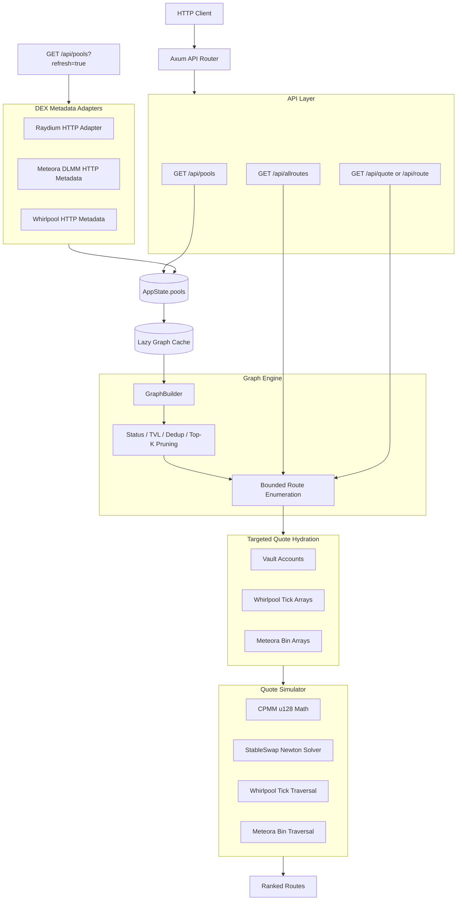
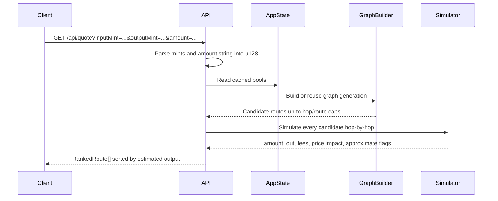

# Swexa

Swexa is a Rust backend for Solana DEX route discovery and exact-input quote simulation. It ingests liquidity from Raydium, Meteora DLMM, and Orca Whirlpool, normalizes pools into one model, builds a directed multigraph, and ranks candidate routes with pool-specific swap math.

## Current Status

- Pool ingestion: Raydium, Meteora DLMM, Whirlpool.
- Quote endpoint: `GET /api/quote` and `GET /api/route`.
- Route discovery endpoint: `GET /api/allroutes`.
- Pool cache endpoint: `GET /api/pools`.
- On-chain hydration: quote-time only for pools used by top candidate routes.
- Tests: unit tests for math/parser/graph logic and integration tests for quote API behavior.

## Architecture



## Quote Flow



## Backend Layout

```text
backend/src
├── lib.rs                  # Reusable app builder and public modules
├── main.rs                 # Thin binary startup
├── adapters/               # Lightweight external DEX metadata ingestion
│   ├── meteora/
│   ├── raydium/
│   └── whirlpool/
├── api/                    # Axum handlers and route registration
├── graph/                  # Graph construction and route ranking
├── hydration/              # RPC account parsers and PDA derivation helpers
├── models/                 # Pool, graph, simulator, and error models
├── services/               # Pool refresh, quote orchestration, targeted hydration
└── types/                  # Shared application state

backend/tests
└── api_quote.rs            # Endpoint-level quote tests through Axum
```

## API

### Refresh Pools

```http
GET /api/pools
GET /api/pools?page=1&page_size=100
GET /api/pools?refresh=true&page=1&page_size=100
```

Returns cached pool metadata with pagination. If the cache is empty, or `refresh=true` is provided, the backend refreshes lightweight DEX metadata and invalidates the graph cache. It does not fetch vaults, tick arrays, or bin arrays.

### Discover Routes

```http
GET /api/allroutes?input_mint=<mint>&output_mint=<mint>&max_hops=3&max_routes=50
```

Returns graph candidate routes sorted by heuristic cost. This endpoint does not simulate exact output amounts.

### Quote Routes

```http
GET /api/quote?inputMint=<mint>&outputMint=<mint>&amount=<atomic_amount>
GET /api/route?input_mint=<mint>&output_mint=<mint>&amount=<atomic_amount>
```

`amount` is parsed as a string-backed `u128` to support large Solana atomic amounts in query strings. The response includes ranked routes, simulated hops, total fees, max price impact, and whether any hop used approximate math.

## Simulator Accuracy

- CPMM: fixed-point `u128` constant-product math.
- StableSwap: bounded Newton solver with convergence errors.
- Whirlpool CLMM: route discovery uses cached metadata, then quote-time hydration fetches only selected route pools' vaults and nearby tick arrays. Quotes fail conservatively if the requested trade crosses beyond hydrated ticks.
- Meteora DLMM: route discovery uses cached metadata, then quote-time hydration fetches only selected route pools' vaults and nearby bin arrays. Quotes fail conservatively if the requested trade needs unhydrated bins. If bin arrays are unavailable, it falls back to guarded active-price spot math and marks the hop approximate.

## Running

```bash
cd backend
SOLANA_RPC_URL=https://api.mainnet-beta.solana.com cargo run
```

Server default:

```text
http://127.0.0.1:8000
```

## Testing

```bash
cd backend
cargo fmt --check
cargo check
cargo test
```

The test suite covers:

- Fixed-point swap math and error handling.
- Whirlpool tick-array parsing and CLMM crossing boundaries.
- Meteora bin-array parsing and DLMM traversal boundaries.
- Graph pruning, deduplication, and route ranking.
- Quote API validation and successful quote responses through the real Axum router.

## Configuration

| Variable | Default | Purpose |
| --- | --- | --- |
| `SOLANA_RPC_URL` | `https://api.mainnet-beta.solana.com` | RPC endpoint used by quote-time vault, tick-array, and bin-array hydration. |

## Production Notes

- Pool metadata is cached in memory and refreshed by `GET /api/pools?refresh=true`.
- Graph construction is lazy and generation-based: pool refreshes invalidate the graph cache.
- `/api/pools` is paginated and does not perform quote-grade RPC hydration.
- On-chain account data is treated as untrusted: parsers validate lengths, discriminators where available, and parent pool relationships.
- Route ranking rejects failed simulations instead of returning guessed liquidity.
