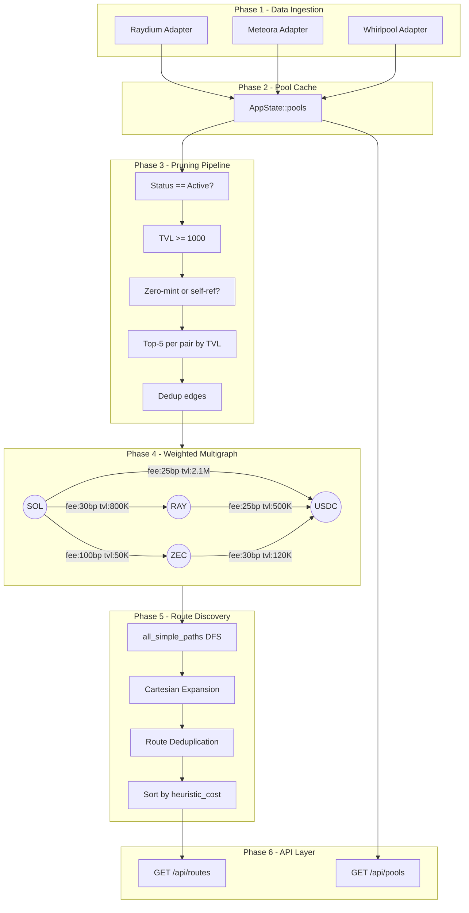

# Swexa — Solana DEX Aggregator

A high-performance Rust-based DEX routing engine for Solana. Swexa discovers liquidity pools across multiple DEXes (Raydium, Meteora, Whirlpool), builds a weighted directed multigraph, and finds the most efficient swap routes between any two tokens.

## Architecture

